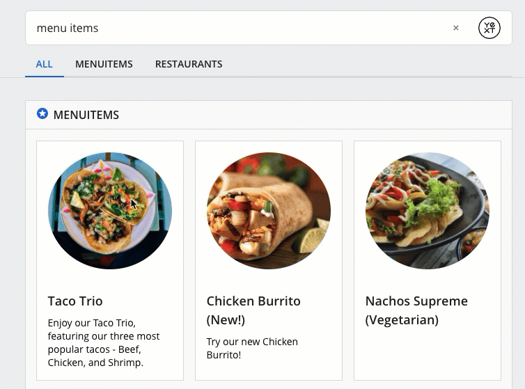

In order to accomplish this, you need to do a few things in the frontend:

1. Add a custom card, forked off of the existing product-prominentimage card
2. Update the custom card’s template.hbs to behave as a link
3. Optional - add CSS styling so that it feels like a single button

**Step 1** is simply forking a *product-prominentimage* card and mapping your data in the component.js as desired.

**Step 2** is where you'll change the format of the card to behave as a single link. In the custom card’s template.hbs, replace lines 1-11 with the below code. This new code checks if there’s a URL and if so, creates a new class HitchhikerProductProminentImage-cardLink, which will hold all of the other content for the card and act as a link using the card’s URL that was defined in the component.json. We’re also passing data-eventtype and data-eventoptions so that a TITLE_CLICK event fires when a user clicks on the link.

*Note: You can’t have links nested within other links, so make sure to remove your CTAs and the title link (by removing from the title partial) from the card if you’re using this approach.*

```hbs
<div class="HitchhikerProductProminentImage {{cardName}}">
  {{#if card.url}}
     <a class="HitchhikerProductProminentImage-cardLink"
          href="{{card.url}}"
          target={{#if card.target}}"{{card.target}}"{{else}}"_top"{{/if}}
          data-eventtype="TITLE_CLICK"
          data-eventoptions='{{json card.titleEventOptions}}'>
  {{/if}}
  {{> image }}
  <div class="HitchhikerProductProminentImage-body">
    {{> title }}
    {{> subtitle }}
    <div class="HitchhikerProductProminentImage-contentWrapper">
         {{> details }}
     </div>
   </div>
   {{#if card.url}}
     </a>
  {{/if}}
</div>
```

Finally for **Step 3** you can add any custom CSS to the answers.scss file. To emphasize the 'click-ability' of the card we suggest adding a hover state - sample SCSS below:
```scss
  .menuitem {
      transition: box-shadow .3s;

      &:hover {
        box-shadow: 0 0 11px rgba(33,33,33,0.2);
        cursor: pointer;
      }
  }
  ```

The end result would look like this:
 


