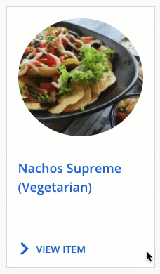

## Overview
Let's say you want to customize the color of the underline on your CTA to be different than the text color.

You would do so with the property of text-decoration-color.

## Instructions
Potential code would look like this:

```css
.HitchhikerCTA {
    color: #006FF0;
    &:hover{
       color: #006FF0;
       text-decoration-color: black; 
 
    }
  }
  ```

Text decoration is the key property and specifies the decoration added to text.

 
