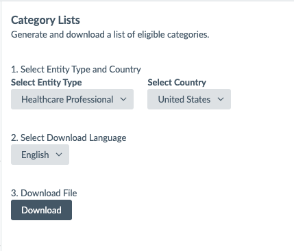

## Overview
The `builtin.medicalSpecialty` field is a special field that exposes the categories for a Healthcare Professional to the Answers Algorithm in the backend. You can use this in your backend configuration, but what if you want to be able to show the specialties on your card?

If you remember, we can only expose data that's returned to us in the API response. Looking at the response that returns Healthcare Professionals, you'll see that the category IDs are returned.

```json
"categoryIds": [
"1502017",
"1257"
],
```

## Instructions

## Building Your Category Mappings
You can find the Category ID to Name mappings in your Accounts Settings tab, under `Content and Templates > Category Lists`, or at https://www.yext.com/s/{yourBusinessId}/account/categoryLists.

Once you navigate here, you can download an Excel workbook with the ID to Name Mappings. 


From this excel, you'll need to format it into a JSON object so we can reference it in our JS file easily. I recommend a site like https://csvjson.com/csv2json.
1. Removed the leading categories and `>` by find/replacing in Excel for "*> ". This removes everything before the last `>` character as well as the space after it.
2. Renamed the column headers to lowercase "id" and "category" for ease of use in my function.
3. Pasted the content into https://csvjson.com/csv2json to get a JSON array of objects, each containing an `id` and a `category` attribute.

A quick gif of the steps is below:


### Creating a Custom JS File
In your `static > assets > js` folder, create a new file called `specialty-mappings.js`. In this file, paste the below: 
```js
/**
 Set the mappings variable to be equal to the JSON array you generated from the step above. Below is an example of a few entries, but your list will be MUCH longer.
**/
var mappings = [ 
  {
    "id": "2090",
    "category": "Medical School"
  },
  {
    "id": "1135249",
    "category": "Nursing School"
  },
  {
    "id": "1352945",
    "category": "Assisted Living Facility"
  },
  {
    "id": "1366244",
    "category": "Gynecology"
  },
  {
    "id": "1350",
    "category": "Obstetrics"
  }
]

/**
 This is the function that reads from the entity profile passed in, grabs the categoryIds, matches it to the mappings above, and outputs an array of Specialty Names.
**/
export function specialtyMappings(profile) {
  if (!profile.categoryIds) {
    return null;
  }
    
  let specialties = [];
  for (let id of profile.categoryIds) {
    let obj = mappings.find(o => o.id === id);
    if (obj) {
      specialties.push(obj.category)
    }
  }
  return specialties;
}
```

### Reference the Custom JS File in your Formatters.js 
1. Override Theme to shadow the `static/assets/js/formatters.js` file
2. Under the existing import statement, paste this additional import statement below. This imports the function you just created.
```
import {
  specialtyMappings
} from './specialty-mappings.js'
```
3. In the `const Formatters` object, add `specialtyMappings` to the bottom. It will look something like this:
```
const Formatters = {
  address,
  phoneLink,
  phoneDisplay,
  nationalizedPhoneDisplay,
  emailLink,
  getDirectionsUrl,
  toKilometers,
  toMiles,
  isTodayHoliday,
  bigDate,
  betterTime,
  dateRange,
  snakeToTitle,
  prettyPrintObject,
  joinList,
  image,
  truncate,
  openStatus,
  generateCTAFieldTypeLink,
  specialtyMappings
};
```
Now, you can reference this formatter as you would any formatter!

### Using the Formatter in a Card
In a custom card, you can set the `subtitle` to use this formatter.

```js
subtitle: profile.categoryIds ? `Specialties: ${Formatter.joinList(Formatter.specialtyMappings(profile), ", ")}`: null, // The sub-header text of the card
```


