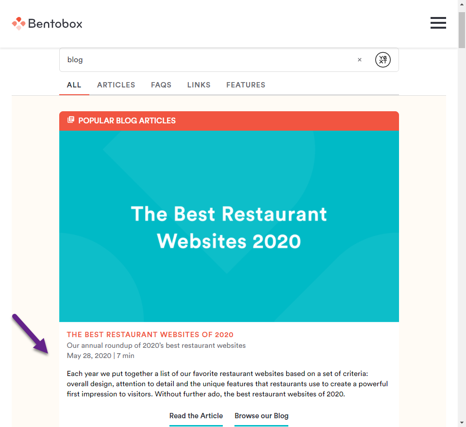

## Overview

The following formatter will allow you to custom format your dates to long-form.

## The Code

Add the below function to your formatters-internal.js file and add the function name (longDate) to your formatters.js file.

When calling the function in your card config file, call Formatters.longDate(profile, '[INSERT_DATE_FIELD]').

```
export function longDate(profile, keyPath) {
  const dateString = _getProfileFieldAtKeyPath(profile, keyPath);
  if (!dateString) {
    return null;
  }
  const date = new Date(dateString);
  const locale = _getDocumentLocale();

  return date.toLocaleString(locale, {day: 'numeric', month: 'long', year: 'numeric'});
}
```

## The Result


