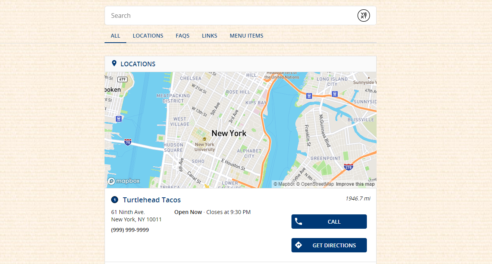

# Update
This Hitchhikers Code Bank page is being deprecated as part of the Fall '22 Release on November 16th 2022. Please reference our new [Search documentation](https://hitchhikers.yext.com/docs/search) for this content and post in the community with any questions.

You can use the `background-image` property to set a background image, using code such as the below. Make sure to place this outside of the `.Answers{}` class in the `answers.scss` file.

```
body, .Answers-footer, .Answers-navWrapper {
  background-image: url("https://hitchhikers.yext.com/img/onward/metaimage.jpg");
  background-size: 100%;
}
```

You can either use the absolute URL of the image if it exists online or upload the image to your assets folder and reference it such as in this unit: https://hitchhikers.yext.com/modules/ans160-core-frontend-adding-pages-and-cards/07-assets-and-static-files/

Additionally, you may need to add additional CSS to adjust the size of the image and account for different device types. Let us know if you have additional questions on this!

The result will look like this:

 


