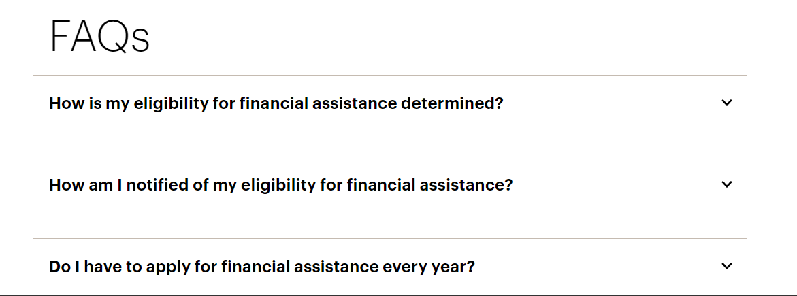

You can style the universal search results to have only top and bottom borders using the code below:

```css
.HitchhikerResultsStandard-title {
border-left: none;
border-right: none;
border-top: none;
border-bottom: 1px solid #c5bbb1;
}

.HitchhikerResultsStandard-titleLabel {
border-left: none;
border-right: none;
border-top: none;
border-bottom: none;
}

.HitchhikerResultsStandard-Card {
border-left: none;
border-right: none;
border-top: none;
border-bottom: 1px solid #c5bbb1;
padding-bottom: 30px;
padding-top: 7px;
}

.HitchhikerResultsStandard-viewMore {
border-left: none;
border-right: none;
border-bottom: none;
border-top: none;
}

.yxt-Card {
border-left:none;
border-right: none;
border-top: none;
border-bottom: 1px solid #c5bbb1;
}
```


The result will look like this:

