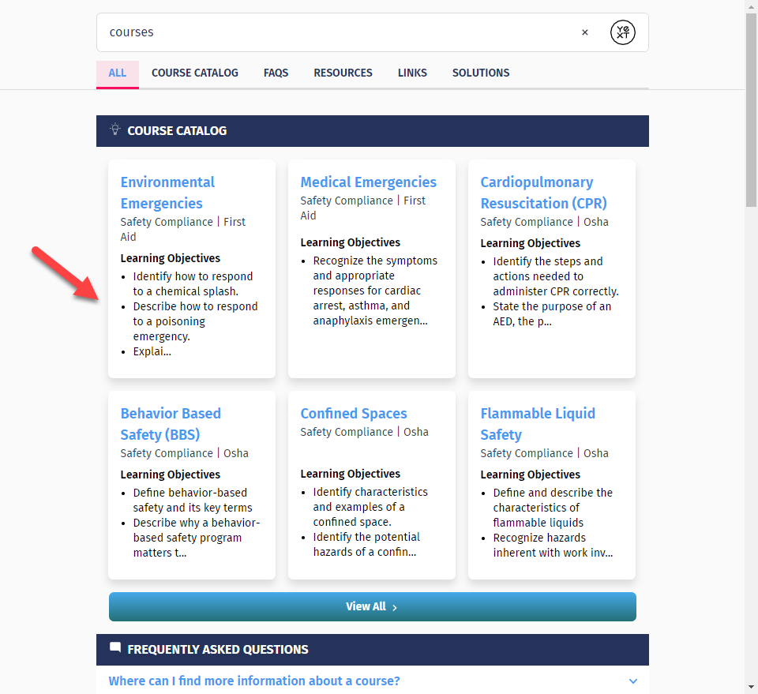

# Update
This Hitchhikers Code Bank page is being deprecated as part of the Fall '22 Release on November 16th 2022. Please reference our new [Search documentation](https://hitchhikers.yext.com/docs/search) for this content and post in the community with any questions.

---
## Overview

If you want to limit the length of a list of text (similar to the showMore functionality for descriptions on cards), then you can do so by looping over the list field that you want listed, checking the length of the whole list each time before adding a new item.

## The Code

You can add the below code within your dataForRender object in the card's component.js file.

```
    let objectives = [];
    let length = 0;
    let maxLength = 100;
    let i = 0;
    while (length < maxLength && profile.[[list_field]] && profile.[[list_field]][i]) {
      if (length + profile.[[list_field]][i].length < maxLength) {
        objectives.push(profile.[[list_field]][i]);
      } else {
        objectives.push(profile.[[list_field]][i].substring(0, maxLength-length) + "...")
      }
      length += objectives[i].length;
      i += 1;
    }
```
## The Result


