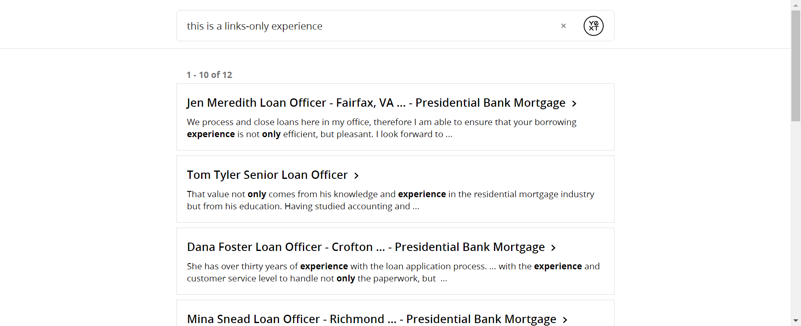

# Update
This Hitchhikers Code Bank page is being deprecated as part of the Fall '22 Release on November 16th 2022. Please reference our new [Search documentation](https://hitchhikers.yext.com/docs/search) for this content and post in the community with any questions.

---
## Overview

For clients who do not convert to a paid experience, the account admin will receive a support ticket notifying of the trial expiration and requesting that the free trial be suspended and moved to a links-only experience. This is so that no KG results appear in search but Yext can continue to track their analytics which may be useful in a future sale. Instructions for how to do so are below. For clients who do not have a Links backend, respond on the ticket asking the action that should be taken.

1.  Update the Search Configuration
  * Remove all verticals EXCEPT for Links
  * Remove hardcoded prompts
2. Update the Repo
  * Remove all vertical configs (.json) and index.json
  * Remove corresponding handlebar files (.hbs) and index.html.hbs
  * Rename the existing links files to 'index'. This will make the links vertical page the default page for the experience.
    * Ex: links.html.hbs -> index.html.hbs, links.json -> index.json
    * This is case sensitive - remember in our training, the "index.html" file is special and is the only file that will automatically default to display at the root of a domain
  * To hide the navigation bar add the below code to the top level of answers.scss
 
 ```css
 .yxt-Nav-container {
    display: none;
  }
  ```

3. Respond to ticket confirming change
4. Move JIRA item (if you haven't already) to Expired Live Trial

## The Result



## Additional Resources

You can also find the above information  in [this Guru Card](https://app.getguru.com/card/Tb4bdeGc/Answers-Free-Trial-Expiration-Process)

