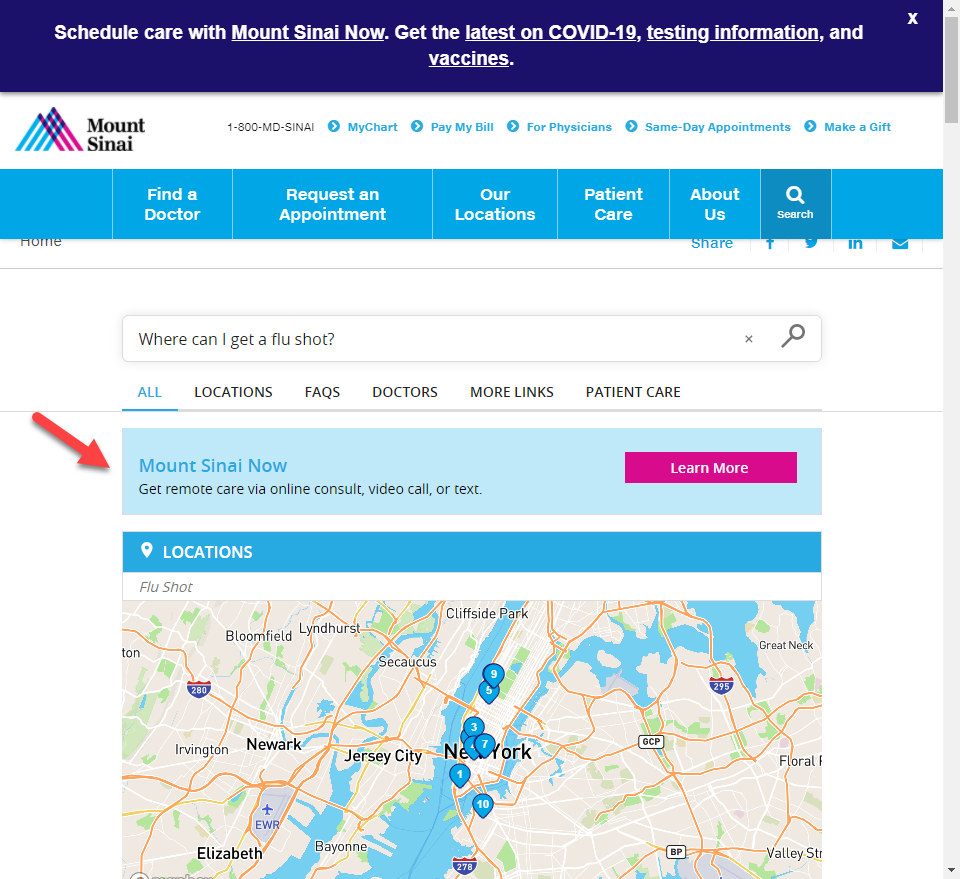
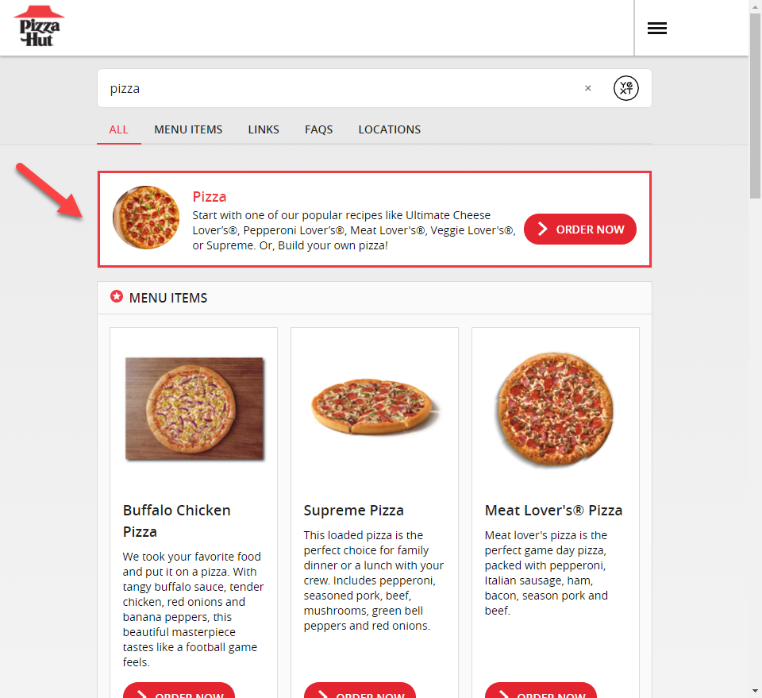

# Update
This Hitchhikers Code Bank page is being deprecated as part of the Fall '22 Release on November 16th 2022. Please reference our new [Search documentation](https://hitchhikers.yext.com/docs/search) for this content and post in the community with any questions.

---
## Overview

Oftentimes a promotion vertical can be used to highlight content based on certain queries. Both [Mount Sinai](../../../Images/Sinai-promo.png) and [Pizza Hut](../../../Images/PH-promo.png) are currenlty utilizing a promo vertical.

## The Code

1. Add a Promotion custom entity type
  * Name
  * Description
  * CTAs
  * URL
  * Photo
  * Answers Keywords

2. Add Promotion entities to the account

3. Add Promotion vertical to Search Config, call it “promotion”.
  * phraseMatch any relevant Answers Keywords - this will trigger the result only if the keyword, or "phrase", is contained in the query
  * baseScore: 100

4. In your Pages code, add the following to your index.json file:
Add the following to your VTC (vertical to config) object after “Universal”:
```
     "promotion": { // The vertical key from your search configuration
      "label": "", // The name of the vertical in the section header and the navigation bar
      "hideInNavigation": true, // hides navbar tab
      "universalLimit": 1, // ensures only one result
      "cardType": "promo-card" // forked card name
    }
```

5. Create (fork) a promo card, styled however you want. Call it promo-card per above “cardType” configuration.

6. In answers.scss, hide the navigation bar and view all section for this “vertical”

```css
.HitchhikerResultsStandard--promotion
{
.HitchhikerResultsStandard-title
{
display:none;
}
.HitchhikerResultsStandard-viewMore
{
display:none;
}
}
```
 
Optionally, add a light background brand color to highlight the promo cards. Add this to your answers.scss file (example below):

```css
.HitchhikerStandard.promo-card
  {
   background-color: #bfe8f8;
  }
```

If the top border of the card is missing, add this code:
```css
    .HitchhikerResultsStandard-Card--universal
    {
      border-top: var(--yxt-border-default);
 
    }
```

## The Result



