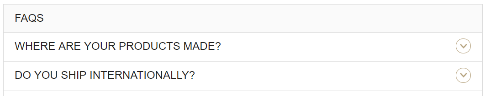

The easiest way to hide the header or results title bar icon is via CSS. You can add the following to the answers.scss file to hide it:

### **Standard Universal Template**
```css
.HitchhikerResultsStandard-title{
    .Icon{
        display: none;
    }
}
```

### **Two Column Grid Template**
```css
.HitchhikerResultsGridThreeColumns-title{
    .Icon{
        display: none;
    }
}
```

### **Two Column Grid Template**
```css
.HitchhikerResultsGridThreeColumns-title{
    .Icon{
        display: none;
    }
}
```

The result will look like this:

