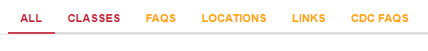

To change the color of the nav bar text so that it does not impact the color change on hover and when a vertical is selected, you can add the following to the answers.scss file: 

```css
--yxt-nav-text-color: white; 
```

The result (when hovering on the classes vertical):



You could also target the following class in the answers.scss file, but it will remove the default color change on hover and when a vertical is selected:

```css
.yxt-Nav-item.is-active {
    color: orange;
```
The result:

