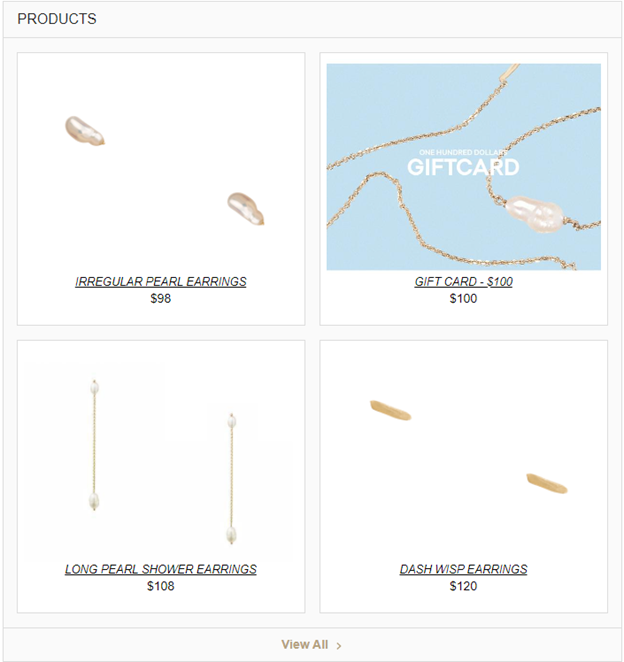
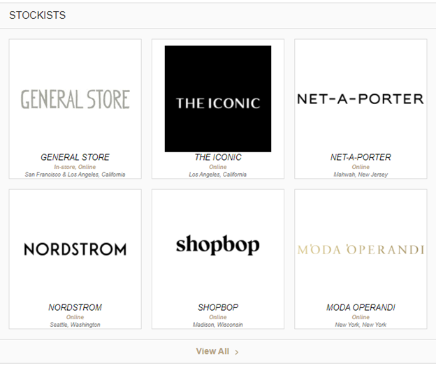

In your config.json file you can specify which universal section template you would like under the *verticalsToConfig* object.

**For example:**

```js
"verticalsToConfig": {
"menuItems": { // The vertical key from your search configuration
"label": "Menu Items", // The name of the vertical in the section header and the navigation bar
"cardType": "menuitem-standard", // The name of the card to use - e.g. accordion, location, customcard
"icon": "star", // The icon to use on the card for this vertical
"universalSectionTemplate": "grid-two-columns"
    }
}
```

## Universal Grid - Two Columns
```grid-two-columns``` (paired with the product-prominentimage card)

 

## Universal Grid - Three Columns
```grid-three-columns``` (paired with the product-prominentimage card)

 

